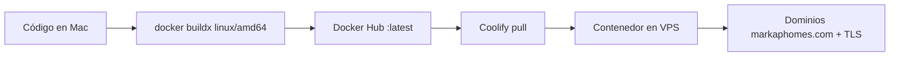

# Playbook: despliegue Coolify + imagen Docker precompilada (Markap Homes)

Guía para desplegar **Markap API + Admin** en Coolify **sin compilar en el VPS**.

Mismo patrón que FactoFarm (`api-factofarm` / `front-factofarm`).

**Dominios finales:** API en `https://api-admin.markaphomes.com` y frontend en `https://admin.markaphomes.com`.

---

## Idea central

| Problema | Decisión |
|----------|----------|
| VPS pequeño: `nest build` / `vite build` satura CPU | **No construir en el VPS** |
| Coolify Nixpacks/Dockerfile en el server = cuello de botella | Pack **`dockerimage`**: Coolify solo hace `pull` + `run` |
| Tags de prueba en Docker Hub | **Solo `latest`** |
| Front SPA necesita env | `VITE_API_BASE_URL` se hornea al build |



---

## Referencia Markap

| App | Imagen | Dominio | Puerto |
|-----|--------|---------|--------|
| API | `santossjba/api-markap:latest` | https://api-admin.markaphomes.com | 4001 |
| Front | `santossjba/front-markap:latest` | https://admin.markaphomes.com | 80 |
| Postgres | `postgresql-db` (`e84y1cim7bbgl5g0627kxdba`) | host interno + `:5433` público | 5432 |

---

## Coolify (UI)

MCP Coolify es **solo lectura**; las apps se crean/configuran en la UI.

### API (`api-markap`)

1. Proyecto **MARKAP HOMES** → `production` → **Add resource** → **Docker Image**.
2. Image: `santossjba/api-markap`, tag: `latest`.
3. Ports exposes: `4001`.
4. Domain: `https://api-admin.markaphomes.com`.
5. Healthcheck: path `/api/health`, port `4001`, start period ≥ 60–120s.
6. Variables runtime (secretos **solo** en Coolify):

| Variable | Valor |
|----------|--------|
| `NODE_ENV` | `production` |
| `PORT` | `4001` |
| `DATABASE_URL` | `postgresql://postgres:<PASSWORD>@e84y1cim7bbgl5g0627kxdba:5432/markap_db` |
| `JWT_SECRET` | (secreto fuerte ≥ 16 chars) |
| `JWT_EXPIRES_IN` | `3600` |
| `FRONTEND_URL` | `https://admin.markaphomes.com` |
| `MINIO_*` | mismos valores de almacenamiento que usas hoy |
| `API_PUBLIC_URL` | `https://api-admin.markaphomes.com` |
| `MAIL_*` / `PASSWORD_RESET_*` | según necesidad |

### Front (`front-markap`)

1. Misma environment → **Docker Image**.
2. Image: `santossjba/front-markap`, tag: `latest`.
3. Ports exposes: `80`.
4. Domain: `https://admin.markaphomes.com`.
5. Healthcheck: path `/`, port `80`.
6. Sin secretos runtime (`VITE_*` van en el **build** de la Mac).

---

## Comandos (Mac)

### API

```bash
cd "/Users/santosjesusbernuiacevedo/Documents/PROYECTOS/Markap Homes/markap_backend"

docker buildx build --platform linux/amd64 \
  -t santossjba/api-markap:latest \
  --push .
```

### Front

```bash
cd "/Users/santosjesusbernuiacevedo/Documents/PROYECTOS/Markap Homes/markap_frontend"

docker buildx build --platform linux/amd64 \
  --build-arg VITE_API_BASE_URL=https://api-admin.markaphomes.com/api \
  --build-arg VITE_APP_ENV=production \
  --build-arg VITE_ENABLE_DEV_TOOLS=false \
  -t santossjba/front-markap:latest \
  --push .
```

### Schema desde Mac (opcional; el entrypoint también hace `db push`)

```bash
# DATABASE_URL con IP/puerto público del Postgres (ej. :5433), no el hostname interno
export NODE_OPTIONS='--experimental-require-module'
pnpm exec prisma db push
```

### Redeploy

1. Coolify → cada app → **Deploy** (pull `latest`).
2. Healthcheck green.
3. Probar `https://api-admin.markaphomes.com/api/health` y abrir `https://admin.markaphomes.com`.

---

## Errores típicos

| Síntoma | Solución |
|---------|----------|
| Build en Coolify cuelga | Pack `dockerimage`, no Dockerfile en VPS |
| Healthcheck `curl: not found` | Ya incluido en Dockerfile |
| Front llama a localhost / API equivocada | Rebuild front con `--build-arg VITE_API_BASE_URL=https://api-admin.markaphomes.com/api` |
| CORS | `FRONTEND_URL=https://admin.markaphomes.com` en la API |
| Mac no conecta a Postgres | Usar IP:5433; interno solo en Coolify |

---

## Resumen

> **Compila en la Mac → `api-markap` + `front-markap` `:latest` → Coolify pull/run → dominios `api-admin` y `admin`.**
